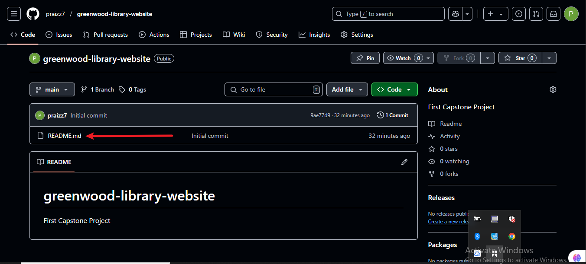
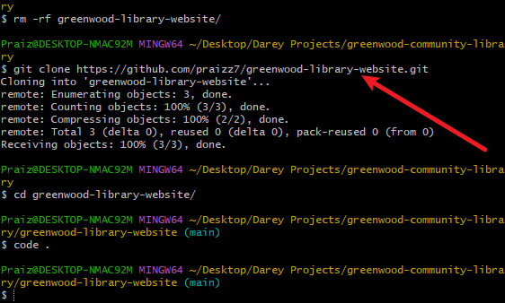
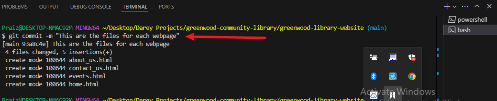
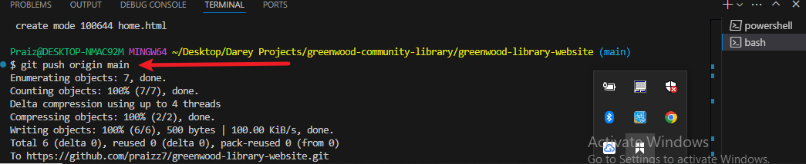
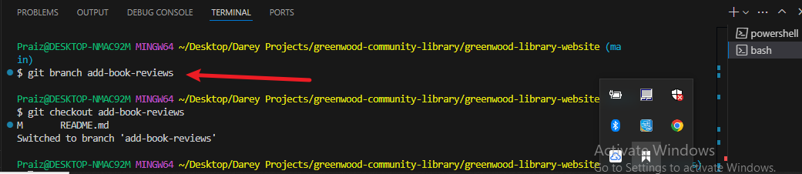
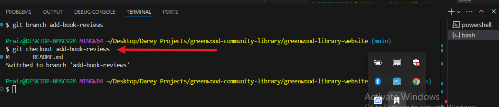
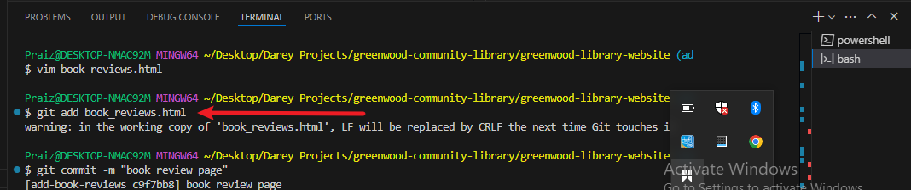

# greenwood-library-website
First Capstone Project

## CapStone Project: Enhancing a Community Library Website
**Background Scenario**
You're part of a development team tasked with enhancing the website for the **"Greenwood Community Library"**. The website aims to be more engaging and informative for its visitors. It currently includes basic sections: **Home**, **About Us**, **Events** and **Contact Us**. Your team decides to add a **"Book Reviews"** section and update the **"Events"** page to feature upcoming community events.

You will simulate the roles of two contributors: **"Morgan"** and **"Jamie"**. Morgan will focus on adding the **"Book Reviews"** section, while Jamie will update the **"Events"** page with new community events.

**Objectives**
- Practice cloning a repository and working with branches in Git
- Gain experience in staging, committing and pushing changes from both developers.
- Create pull requests and merge them after resolving any potential conflicts.

**Setup**
1. Create a Repository on GitHub:
- Name it **greenwood-library-website**

- Initialize it with a README.md file and clone it to your local machine.

**Tasks**
1. In the main branch, using Visual Studio Code editor ensure there are files for each of the webpages.
- home.html

- about_us.html

- events.html

- contact_us.html

2. Add random content into each of the files.

3. Stage, commit and push the changes directly to the **main** branch. (This is a simulation of the team's existing code base for the website)
- Stage
1. Stage home.html

2. Stage events.html

3. Stage contact_us.html

4. Stage about_us.html

- Commit

- Push

## Morgan's Work: Adding Book Reviews
1. Create a branch for Morgan.

2. Switch to the new branch named **add-book-reviews**

3. Add a new file **book_reviews.html** to represent the Book Review Section.

4. Add a random text content into file.

5. Stage, Commit and Push changes with a message like **"Add book reviews section"**
- Stage

- Commit

- Push

6. Push the **add-book-reviews** branch to GitHub

7. Raise a PR for Morgan's work

8. Merge Morgan's work to the **main** branch

## Jamie's Work: Updating Events Page
We'll repeat the same work flow for Jamie's work on events page and ensure Jamie's work is on **update-events** branch.
1. Create a branch for Jamie:

2. Switch to a new branch named **update-events**

3. Add a new file **book_reviews.html** to represent the Book Review Section.

4.  Add a random text content into file.

5. Stage, Commit and Push changes with a message like **"Add book reviews section"**
- Stage

- Commit

- Push

6. Push the **update-events** branch to GitHub

7. Pull the latest changes from the main branch into **update-events** before raising the PR

8. Raise a PR for Jamie's work

9. Merge Jamie's work to the **main** branch

